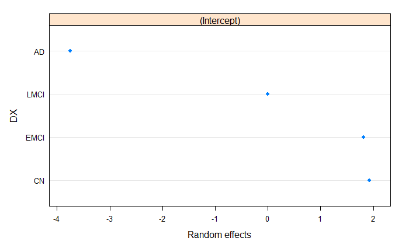
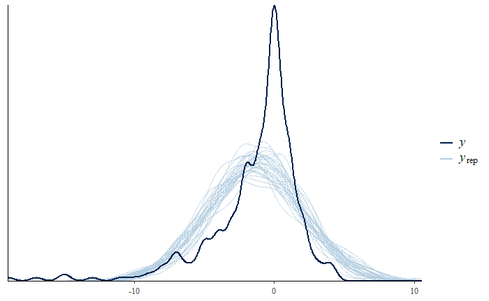
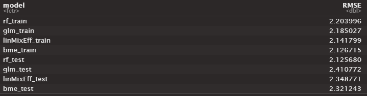
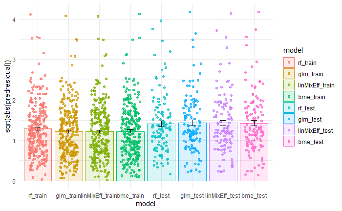
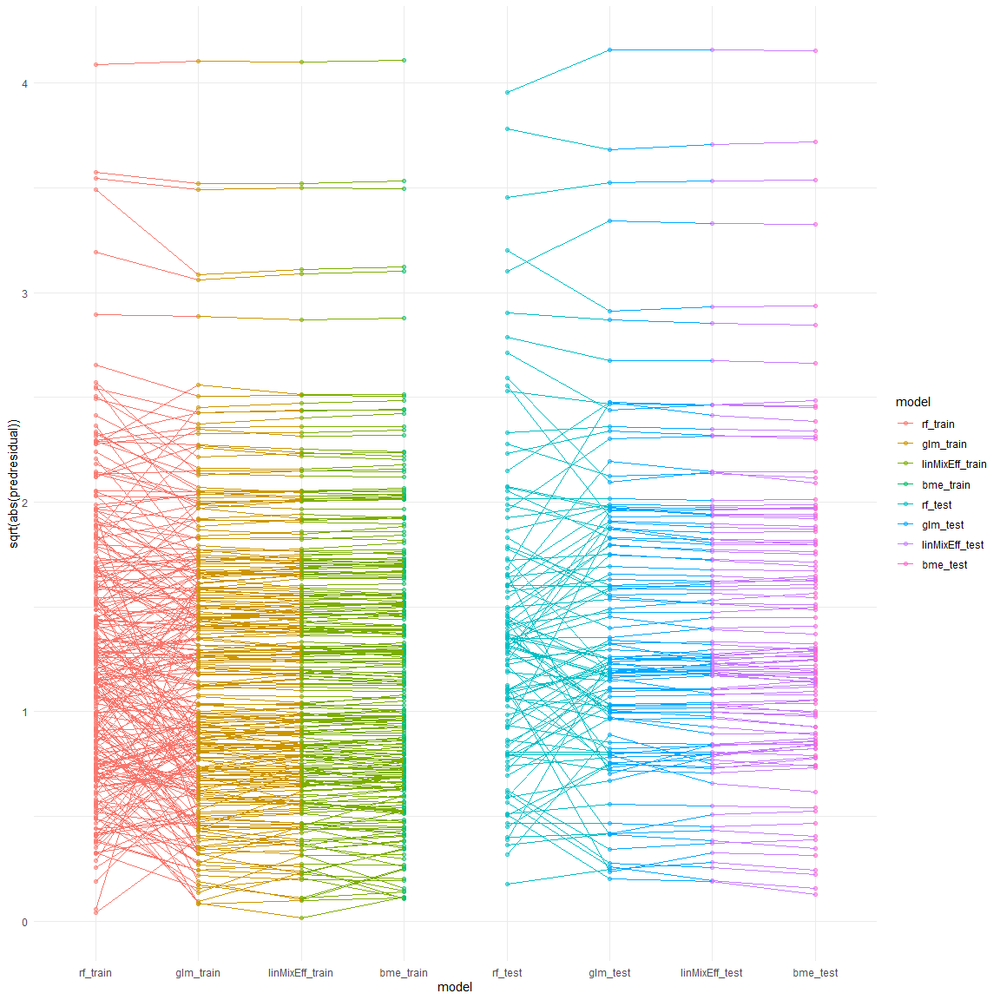

[![Contributors][contributors-shield]][contributors-url]
[![Forks][forks-shield]][forks-url]
[![Stargazers][stars-shield]][stars-url]
[![Issues][issues-shield]][issues-url]
[![MIT License][license-shield]][license-url]

<!-- PROJECT LOGO -->
<br />
<div align="center">
  <a href="https://github.com/austinmarckx/2022UTSWMachineLearningFinalProj">
    
  </a>

<h3 align="center">2022 UTSW Machine Learning Group Project</h3>

  <p align="center">
   Project 8: Alzheimer's Disease, predicting delta MMSE 
    <br />
    <a href="https://github.com/austinmarckx/2022UTSWMachineLearningFinalProj"><strong>Explore the docs »</strong></a>
    <br />
    <br />
    <a href="https://github.com/austinmarckx/2022UTSWMachineLearningFinalProj">View Demo</a>
    ·
    <a href="https://github.com/austinmarckx/2022UTSWMachineLearningFinalProj/issues">Report Bug</a>
    ·
    <a href="https://github.com/austinmarckx/2022UTSWMachineLearningFinalProj/issues">Request Feature</a>
  </p>
</div>

<!-- TABLE OF CONTENTS -->
<details>
  <summary>Table of Contents</summary>
  <ol>
    <li>
      <a href="#about-the-project">About The Project</a>
    </li>
    <li>
      <a href="#getting-started">Getting Started</a>
      <ul>
        <li><a href="#preprocessing">Preprocessing</a></li>
        <li><a href="#exploratory-plotting">Exploratory Plotting</a></li>
        <li><a href="#feature-selection">Feature Selection</a></li>
      </ul>
    </li>
    <li>
        <a href="#modeling">Modeling</a>
        <ul>
            <li><a href="#model-selection">Model Selection</a></li>
            <li><a href="#model-training">Model Training</a></li>
            <li><a href="#model-evaluation">Model Evaluation</a></li>
        </ul>
    </li>
    <li><a href="#conclusions">Conclusions</a></li>
    <li><a href="#project-contributions">Project Contributions</a></li>
    <li><a href="#acknowledgments">Acknowledgments</a></li>
  </ol>
</details>


<!-- ABOUT THE PROJECT -->
## About The Project

<figure>
  
  <figcaption><b>Fig 1.</b> Project Details.</figcaption>
</figure>

<br></br>

What is the MMSE?

<figure>
  
  <figcaption><b>Link: </b> https://oxfordmedicaleducation.com/geriatrics/mini-mental-state-examination-mmse/ </figcaption>
</figure>

<br></br>

Sample MMSE:
<figure>
  
  <figcaption><b>Link: </b> https://cgatoolkit.ca/Uploads/ContentDocuments/MMSE.pdf </figcaption>
</figure>

<p align="right">(<a href="#top">back to top</a>)</p>

<!-- GETTING STARTED -->
## Getting Started

The goal of this projet is to predict the change in MMSE score `MMSE.Change` (Y) given baseline patient features. Note, this is a regression problem and although `MMSE` is a discrete count the predicted quanitity `MMSE.Change` will be treated as a continuous variable.


Preprocessing:
- Exploratory plotting
  - Pairs plot
  - Baseline vs. Target density
  - Paired density by diagnosis

Feature Selection and Dimension reduction:
- Feature selection
- PCA
- FAMD

Model training
- General Linear Model
- Random Forest
- Linear Mixed Effects
- Bayesian Mixed Effects
- (XGBoost?) Data Augmentation

### Preprocessing

```{r}
# Read in file
df <- read_xlsx('./data/AD.training.xlsx') %>% 
transform(
  PTID = factor(PTID),
  DX = factor(DX.bl),
  PTGENDER = factor(PTGENDER),
  APOE4 = factor(APOE4)
)

df %>% head()
```

First, the dataset was read into R, then the data integrity was quickly validated by
- Checking column names/datatypes
  - Including understanding the meaning of each feature/categorical entry
- Checking for missing values
- Checking basic summary statistics

Note that levels of the DX (diagnosis) column are as follows:
- CN : Cognitively normal
- EMCI : Early Mild Cognitive Impairment
- LMCI : Late Mile Cognitive Impairment
- AD : Alzheimer's Disease

<figure>
  
  <figcaption><b>Fig 2.</b> Head of Dataset.</figcaption>
</figure>

<p align="right">(<a href="#top">back to top</a>)</p>

After a cursory examination of the dataset, it is important to realize here that our relevant feature space is _extremely_ limited.  Of the 10 original columns in the dataset, 1 (`MMSE.Change`) is the response variable, and 3 (`RID`, `PTID`, `EXAMDATE`) have minimal-no predictive information in isolation.  This leaves only 6 columns for training on a dataset with 384 entries. In short, unless there are very dominant features with extremely high predictive value, this is very little data for a very complicated problem and this will likely result in relatively high variance in the regressive models.

### Exploratory Plotting

```{r, fig.width= 18, fig.height=18, message = FALSE, warning = FALSE}
df %>% 
  select(AGE, PTEDUCAT, MMSE, everything(), MMSE.Change, -RID, -PTID, -EXAMDATE) %>% # removing factors with too many levels or irrelevant features
  ggpairs(aes(fill = DX, alpha = 0.7), progress = FALSE)

```

There are several observations we can make from the plot below.

1) The grid pattern seen in the `MMSE` vs `PTEDUCAT` scatter plot is indicative of two discrete variables.  Indeed, both years of education and MMSE are represented as whole numbers in this dataset.  While this may not have a large impact on our predictive model, it is nevertheless important to recongize the underlying structure of our data.
2) The distribution of `MMSE` appears to be have a strong left skew. Moreover, this value is relatively weakly correleated with the outcome variable `MMSE.Change`. Later, we will examine how a couple of transforms change the correlation and distribution of `MMSE` and `MMSE.Changed`
3) Looking by eye, `MMSE.Change` seems relatively comparable between most categorical features and `MMSE` seems to be the only quantitative feature significantly correlated with the aforementioned. `DX` perhaps shows a modestly lower `MMSE.Change` in the case of AD, but the variance is quite large.  
4) Again by eye, there do not appear to be any very strong linear dependencies between features.

<figure>
  
  <figcaption><b>Fig 3.</b> Exploratory Pair Plot.</figcaption>
</figure>

```{r}
df %>%
  ggplot(aes(x = `MMSE.Change`, y = DX, group = DX, fill = factor(stat(quantile)))) + 
  stat_density_ridges(
    geom = "density_ridges_gradient",
    calc_ecdf = TRUE,
    quantiles = 4,
    quantile_lines = TRUE, 
    jittered_points = TRUE,
    scale = 0.9,
    position = position_points_jitter(width = 0.05, height = 0.1),
    point_size = 1, point_alpha = 0.5, alpha = 0.7) + 
  theme_minimal() +
  scale_fill_brewer(name = 'Quartiles')
```

<figure>
  
  <figcaption><b>Fig 4.</b> MMSE Ridgeline Plot.</figcaption>
</figure>

Due to the basal distributions being quite similar in both shape and range for the majority of values, it will likely be quite difficult to get a predictor with low variance.

```{r}
df %>%
  select(PTID, `MMSE.Change`, MMSE, DX) %>%
  mutate(MMSE4mo = MMSE + `MMSE.Change`) %>%
  select(-`MMSE.Change`) %>%
  pivot_longer(cols = c(MMSE4mo, MMSE),  names_to = 'time', values_to = 'MMSE') %>%
  ggplot(aes(x = MMSE, y = time, group = PTID, color = DX)) + 
    geom_jitter(width = 0.2, height = 0.075) +
    geom_line() +
    geom_violin(aes(color = NULL, fill = time, group = time), alpha = 0.15, draw_quantiles = c(0.25, 0.5, 0.75)) + 
  theme_minimal() +
  facet_wrap(~DX)
```

<figure>
  
  <figcaption><b>Fig 5.</b> Change in MMSE by DX Ridgeline Plot.</figcaption>
</figure>

In some groups (CN/EMCI), the line/points clearly indicate subject variability. This variability seems to increase in LMCI and AD.  Note that because the MMSE score is capped at 30, we may have some censoring which could cause the measure of center to shift to the left.

<p align="right">(<a href="#top">back to top</a>)</p>

```{r, fig.width= 12, fig.height=12, message = FALSE, warning = FALSE}
df %>% 
  mutate(asinsqrtMMSE = asin(sqrt(minmax(MMSE))), logMMSE = log(MMSE+1), MMSE4mo = MMSE + `MMSE.Change`, logMMSE4mo = log(MMSE4mo+1), asinsqrtMMSE4mo = asin(sqrt(minmax(MMSE4mo)))) %>%
  select(MMSE, asinsqrtMMSE, logMMSE, MMSE.Change, MMSE4mo, logMMSE4mo, asinsqrtMMSE4mo, DX) %>% # removing factors with too many levels or irrelevant features
  ggpairs(aes(fill = DX, alpha = 0.7), progress = FALSE)

```

<figure>
  
  <figcaption><b>Fig 6.</b> MMSE Transforms</figcaption>
</figure>

Note that of the transforms performed, the asin-sqrt transform of `MMSE4mo` showed the strongest correlation to the baseline `MMSE`. If necessary, we will try a model both using the transformed dependent variable and with the raw data.

### Feature Selection

`RID` and `EXAMDATE` have minimal-no predictive information and we will drop these values for all models. `PTID` will only be included in the linear mixed effects model as a random effect.

In order to see if our data can be condensed, we tried PCA and FAMD for dimensionality reduction.

#### PCA

PCA is only used on the numerical columns present in the dataset (i.e. `AGE`, `PTEDUCAT`, and `MMSE`). If these features are collinear, we would expect that one of the principle component axes to be a combination of the two features an to explain a proportionally larger amount of variance. 

```
resPCA <- PCA(df_numerical) # Note, this automatically scales the data
resPCA$eig
fviz_screeplot(resPCA)
corrplot(resPCA$var$contrib, is.corr = FALSE, col = COL2('PiYG', 20))
fviz_pca_ind(resPCA, col.ind = "contrib", 
             gradient.cols = c("#00AFBB", "#E7B800", "#FC4E07"),
             repel = TRUE)
fviz_pca_var(resPCA, col.var = "contrib", 
             gradient.cols = c("#00AFBB", "#E7B800", "#FC4E07"),
             repel = TRUE)
```
<figure>
  
  <figcaption><b>Fig 6.</b> PCA plot of numerical variables.</figcaption>
</figure>

Here we can see that while there appears to be some overlap in information of `PTEDUCAT` and `MMSE`, the increase is not large enough, in our opinion, to justify using the PCA columns compared to the raw features.  This is in part due to the relative difficulty of explaining feature importances in PCA space.

#### FAMD

FAMD (or Factor Analysis of Mixed Data) can be summarized as PCA which can tolerate categorical variables. Similar to the PCA, we are looking for collinearity/redundancy of information in our dataset.

```{r}
resFAMD <- FAMD(X)
resFAMD$eig
corrplot(resFAMD$var$contrib, is.corr = FALSE, col = COL1('YlGn', 20))
fviz_famd_var(resFAMD,"var",
             repel = TRUE)
fviz_mfa_ind(resFAMD, 
             habillage = "DX", # color by groups 
             #palette = c("#00AFBB", "#E7B800", "#FC4E07"),
             addEllipses = TRUE, ellipse.type = "confidence", 
             repel = TRUE # Avoid text overlapping
             ) 
```

<figure>
  
  <figcaption><b>Fig 7.</b> FAMD plots variables.</figcaption>
</figure>

Again similar to PCA, the features appear (for the most part) to represent independent information.  Once again, we do not consider the amount of varince explained to be large enough to justify the increased difficulty in model interpretability.

<p align="right">(<a href="#top">back to top</a>)</p>

## Modeling

* General Linear Model
* Random Forest
* Linear Mixed Effects
* Bayesian Mixed Effects

### General Linear Model

#### Setup
```{r}
# Train
gauss <- glm(`MMSE.Change` ~ AGE+MMSE+PTGENDER+PTEDUCAT+APOE4+DX, data = train, family = gaussian())

# Summary
coef(summary(gauss))[,4]
summary(gauss)

# Predictions
train$glm_train <- predict(gauss)
test$glm_test <- predict(gauss, newdata = test)
```

#### Summary
```
 (Intercept)          AGE         MMSE PTGENDERMale     PTEDUCAT       APOE41       APOE42       DXEMCI       DXLMCI         DXAD 
9.776112e-02 6.930991e-02 9.156906e-04 1.409894e-01 8.494118e-01 2.626664e-01 2.417992e-01 8.280865e-01 6.833086e-05 4.718292e-11 

Call:
glm(formula = MMSE.Change ~ AGE + MMSE + PTGENDER + PTEDUCAT + 
    APOE4 + DX, family = gaussian(), data = train)

Deviance Residuals: 
     Min        1Q    Median        3Q       Max  
-16.8496   -0.9282    0.3585    1.5829    8.3350  

Coefficients:
             Estimate Std. Error t value Pr(>|t|)    
(Intercept)   6.90773    4.15676   1.662 0.097761 .  
AGE           0.04971    0.02725   1.824 0.069310 .  
MMSE         -0.38830    0.11577  -3.354 0.000916 ***
PTGENDERMale  0.56035    0.37948   1.477 0.140989    
PTEDUCAT      0.01315    0.06920   0.190 0.849412    
APOE41       -0.45500    0.40533  -1.123 0.262666    
APOE42       -0.74760    0.63724  -1.173 0.241799    
DXEMCI       -0.12139    0.55842  -0.217 0.828086    
DXLMCI       -2.03497    0.50274  -4.048 6.83e-05 ***
DXAD         -6.04550    0.87980  -6.871 4.72e-11 ***
---
Signif. codes:  0 ‘***’ 0.001 ‘**’ 0.01 ‘*’ 0.05 ‘.’ 0.1 ‘ ’ 1

(Dispersion parameter for gaussian family taken to be 8.392672)

    Null deviance: 2932.4  on 268  degrees of freedom
Residual deviance: 2173.7  on 259  degrees of freedom
AIC: 1347.5

Number of Fisher Scoring iterations: 2
```

In terms of feature importances, the only significant coefficients (after p.value correction) are in the feature `DX` (specifically `LMCI` and `AD`) which as shown above were the two classes with visually different distributions of MMSE score at baseline and at 4 months.

<p align="right">(<a href="#top">back to top</a>)</p>

### Random Forest

#### Setup
```{r}
# Train
rf <- randomForest(`MMSE.Change` ~ AGE+MMSE+PTGENDER+PTEDUCAT+APOE4+DX, data = train, ntrees = 500, importance = TRUE, type = 'regression')

# Summary
rf
plot(rf)
importance(rf)
varImpPlot(rf)

# Predictions
train$rf_train <- predict(rf)
test$rf_test <- predict(rf, newdata = test)
```

#### Summary
```
Call:
 randomForest(formula = MMSE.Change ~ AGE + MMSE + PTGENDER +      PTEDUCAT + APOE4 + DX, data = train, ntrees = 500, importance = TRUE,      type = "regression") 
               Type of random forest: regression
                     Number of trees: 500
No. of variables tried at each split: 2

          Mean of squared residuals: 9.146725
                    % Var explained: 16.09
           %IncMSE IncNodePurity
AGE       8.595047      680.1893
MMSE     15.011456      496.0904
PTGENDER  2.114726      109.2167
PTEDUCAT  4.504497      321.4011
APOE4    -2.518888      195.3548s
DX       24.510405      490.3861

```

<figure>
  
  <figcaption><b>Fig 7.</b> Random Forest Regression Plots.</figcaption>
</figure>
  

Similar to the GLM, the Random Forest model struggles to give good predictions. In terms of feature importances, once again `DX` is quite important in decreasing the MSE.  The baseline MMSE also surfaces as an important predictor of the MMSE Change.  That said, the RMSE is once again quite large.  

<p align="right">(<a href="#top">back to top</a>)</p>


### Linear Mixed Effects

#### Setup
```{r}
# Train
linMixEff <- lme(`MMSE.Change`~ AGE+MMSE+PTGENDER+PTEDUCAT+APOE4 , random = ~ 1|DX, data = train)

# Summary
linMixEff
summary(linMixEff)

# Predictions
train$linMixEff_train <- predict(linMixEff)
test$linMixEff_test <- predict(linMixEff, newdata = test)
```

#### Summary
```
Linear mixed-effects model fit by REML
  Data: train 
  Log-restricted-likelihood: -676.6212
  Fixed: MMSE.Change ~ AGE + MMSE + PTGENDER + PTEDUCAT + APOE4 
 (Intercept)          AGE         MMSE PTGENDERMale     PTEDUCAT       APOE41       APOE42 
  3.91666593   0.04941079  -0.35126601   0.56801388   0.01218666  -0.48859860  -0.78098112 

Random effects:
 Formula: ~1 | DX
        (Intercept) Residual
StdDev:    2.697636 2.897503

Number of Observations: 269
Number of Groups: 4 

Linear mixed-effects model fit by REML
  Data: train 

Random effects:
 Formula: ~1 | DX
        (Intercept) Residual
StdDev:    2.697636 2.897503

Fixed effects:  MMSE.Change ~ AGE + MMSE + PTGENDER + PTEDUCAT + APOE4 
 Correlation: 
             (Intr) AGE    MMSE   PTGEND PTEDUC APOE41
AGE          -0.585                                   
MMSE         -0.757  0.119                            
PTGENDERMale  0.119 -0.145 -0.028                     
PTEDUCAT     -0.133  0.015 -0.177 -0.271              
APOE41       -0.109  0.100 -0.004 -0.090  0.098       
APOE42       -0.169  0.180  0.050 -0.058  0.066  0.307

Standardized Within-Group Residuals:
       Min         Q1        Med         Q3        Max 
-5.8077759 -0.3162452  0.1115573  0.5588864  2.8449251 

Number of Observations: 269
Number of Groups: 4 

```
<figure>
  
  <figcaption><b>Fig.</b> Linear Mixed Effects Coefficients.</figcaption>
</figure>

<figure>
  
  <figcaption><b>Fig.</b> Linear Mixed Effects Random Effects.</figcaption>
</figure>


### Bayesian Mixed Effects

```{r}
# Train
bme <- brm(MMSE.Change ~ AGE+MMSE+PTGENDER+PTEDUCAT+APOE4 + (1|DX), data = train)

# Summary
summary(bme)
pp_check(bme, ndraws = 30)

# Predictions
train$bme_train <- predict(bme)[,1]
test$bme_test <- predict(bme, newdata = test)[,1]
```

#### Summary
```
 Family: gaussian 
  Links: mu = identity; sigma = identity 
Formula: MMSE.Change ~ AGE + MMSE + PTGENDER + PTEDUCAT + APOE4 + (1 | DX) 
   Data: train (Number of observations: 269) 
  Draws: 4 chains, each with iter = 2000; warmup = 1000; thin = 1;
         total post-warmup draws = 4000

Group-Level Effects: 
~DX (Number of levels: 4) 
              Estimate Est.Error l-95% CI u-95% CI Rhat Bulk_ESS Tail_ESS
sd(Intercept)     2.97      1.18     1.39     5.94 1.00     1378     1865

Population-Level Effects: 
             Estimate Est.Error l-95% CI u-95% CI Rhat Bulk_ESS Tail_ESS
Intercept        4.11      4.26    -4.33    12.46 1.00     2785     2452
AGE              0.05      0.03    -0.00     0.10 1.00     4020     2908
MMSE            -0.34      0.12    -0.57    -0.10 1.00     3727     3104
PTGENDERMale     0.57      0.38    -0.17     1.33 1.00     3258     2692
PTEDUCAT         0.01      0.07    -0.12     0.15 1.00     3773     3179
APOE41          -0.50      0.40    -1.27     0.32 1.00     3366     2829
APOE42          -0.81      0.63    -2.05     0.41 1.00     3631     3204

Family Specific Parameters: 
      Estimate Est.Error l-95% CI u-95% CI Rhat Bulk_ESS Tail_ESS
sigma     2.91      0.13     2.67     3.18 1.00     4278     2700

Draws were sampled using sampling(NUTS). For each parameter, Bulk_ESS
and Tail_ESS are effective sample size measures, and Rhat is the potential
scale reduction factor on split chains (at convergence, Rhat = 1).
```

<figure>
  
  <figcaption><b>Fig. </b> Bayesian Mixed Effects Posterior Predictive check.</figcaption>
</figure>


### Evaluation

#### Reformat results
```{r}
# Cleaning results for plotting
train2 <- train %>%
  pivot_longer(cols = c(glm_train, rf_train, linMixEff_train, bme_train), names_to = "model", values_to = "ypred") %>%
  mutate(predresidual = MMSE.Change - ypred, model = factor(model, levels = c("rf_train","glm_train", "linMixEff_train", "bme_train")) ) #%>%

test2 <- test %>%
  pivot_longer(cols = c(glm_test, rf_test, linMixEff_test, bme_test), names_to = "model", values_to = "ypred") %>%
  mutate(predresidual = MMSE.Change - ypred, model = factor(model, levels = c("rf_test","glm_test", "linMixEff_test", "bme_test")) )

results <- train2 %>% bind_rows(test2)
```

#### RMSE
```{r}
# RMSE:
results %>% 
  group_by(model) %>%
  summarize(RMSE = sqrt(mean(predresidual ^ 2)))
```

<figure>
  
  <figcaption><b>Fig .</b> RMSE per model.</figcaption>
</figure>

While the RMSE was technically the lowest for the general linear model model for the training set, the random forest performed the best on the test dataset.

#### Absolute Residual per Model
```{r}
results %>% 
  ggplot(aes(x = model, y = sqrt(abs(predresidual)), color = model, fill = model)) + 
    geom_jitter(width = 0.3, height = 0.035, alpha = 0.7) +
    stat_summary(fun.y = mean, geom = "bar", alpha = 0.15) +
    stat_summary(fun.data = mean_se, geom = "errorbar", color = "black", width= 0.2) +
    theme_minimal()
```
<figure>
  
  <figcaption><b>Fig.</b> Comparisons of absolute prediction error between models.</figcaption>
</figure>

While the mean absolute error appears to be essentially identical for all models. Bars/errorbars indicate mean/SEM respectively. Square Root transform is applied to the y-axis for visual purposes as a few values have very large residuals.


#### Absolute Residual per Model per Individual
```{r}
results %>%
  ggplot(aes(x = model, y = sqrt(abs(predresidual)), color = model, fill = model)) + 
    geom_point(alpha = 0.5) +
    geom_line(aes(group = PTID), size = 0.01) +
    theme_minimal() 
```
<figure>
  
  <figcaption><b>Fig.</b> Comparisons of prediction error between models for each individual.</figcaption>
</figure>

GLM, LME, and BME all produce relatively similar predictions for an individual. (As indicated by horizontal lines between the models). On the other hand, Random forest seems to substantially differ from the other three models. 

<p align="right">(<a href="#top">back to top</a>)</p>

## Discussion / Conclusions

Despite extensive efforts to improve model performance, the RMSE is relatively high for this regression task.  This was anticipated, however, due to the size of the input and complexity of the output variable.

### Future Directions
- Could do some dataset pruning/outlier removal
- Could try boosting as some models seemed to predict better for certain individuals
- Could try more transforms of continuous variables.


<p align="right">(<a href="#top">back to top</a>)</p>

<!-- Project Contributions -->
## Project Contributions

* Austin Marckx - Austin.Marckx@UTSouthwestern.edu
  * Preprocessing & feature selection
  * GLM, RF, LME, and BME creation & evaluation

* Noah Chang - WooYong.Chang@UTSouthwestern.edu
  * Data Augmentation
  * Presentation

Project Link: [https://github.com/austinmarckx/2022UTSWMachineLearningFinalProj](https://github.com/austinmarckx/2022UTSWMachineLearningFinalProj)

<p align="right">(<a href="#top">back to top</a>)</p>

<!-- ACKNOWLEDGMENTS -->
## Acknowledgments

- MMSE Overview: https://oxfordmedicaleducation.com/geriatrics/mini-mental-state-examination-mmse/
- MMSE Sample Exam: https://cgatoolkit.ca/Uploads/ContentDocuments/MMSE.pdf

<p align="right">(<a href="#top">back to top</a>)</p>


<!-- MARKDOWN LINKS & IMAGES -->
<!-- https://www.markdownguide.org/basic-syntax/#reference-style-links -->
[contributors-shield]: https://img.shields.io/github/contributors/austinmarckx/2022UTSWMachineLearningFinalProj.svg?style=for-the-badge
[contributors-url]: https://github.com/austinmarckx/2022UTSWMachineLearningFinalProj/graphs/contributors
[forks-shield]: https://img.shields.io/github/forks/austinmarckx/2022UTSWMachineLearningFinalProj.svg?style=for-the-badge
[forks-url]: https://github.com/austinmarckx/2022UTSWMachineLearningFinalProj/network/members
[stars-shield]: https://img.shields.io/github/stars/austinmarckx/2022UTSWMachineLearningFinalProj.svg?style=for-the-badge
[stars-url]: https://github.com/austinmarckx/2022UTSWMachineLearningFinalProj/stargazers
[issues-shield]: https://img.shields.io/github/issues/austinmarckx/2022UTSWMachineLearningFinalProj.svg?style=for-the-badge
[issues-url]: https://github.com/austinmarckx/2022UTSWMachineLearningFinalProj/issues
[license-shield]: https://img.shields.io/github/license/austinmarckx/2022UTSWMachineLearningFinalProj.svg?style=for-the-badge
[license-url]: https://github.com/austinmarckx/2022UTSWMachineLearningFinalProj/blob/master/LICENSE.txts
