[![Contributors][contributors-shield]][contributors-url]
[![Forks][forks-shield]][forks-url]
[![Stargazers][stars-shield]][stars-url]
[![Issues][issues-shield]][issues-url]
[![MIT License][license-shield]][license-url]

<!-- PROJECT LOGO -->
<br />
<div align="center">
  <a href="https://github.com/austinmarckx/2022UTSWMachineLearningFinalProj">
    
  </a>

<h3 align="center">2022 UTSW Machine Learning Group Project</h3>

  <p align="center">
   Project 8: Alzheimer's Disease, predicting delta MMSE 
    <br />
    <a href="https://github.com/austinmarckx/2022UTSWMachineLearningFinalProj"><strong>Explore the docs »</strong></a>
    <br />
    <br />
    <a href="https://github.com/austinmarckx/2022UTSWMachineLearningFinalProj">View Demo</a>
    ·
    <a href="https://github.com/austinmarckx/2022UTSWMachineLearningFinalProj/issues">Report Bug</a>
    ·
    <a href="https://github.com/austinmarckx/2022UTSWMachineLearningFinalProj/issues">Request Feature</a>
  </p>
</div>

<!-- TABLE OF CONTENTS -->
<details>
  <summary>Table of Contents</summary>
  <ol>
    <li>
      <a href="#about-the-project">About The Project</a>
    </li>
    <li>
      <a href="#getting-started">Getting Started</a>
      <ul>
        <li><a href="#preprocessing">Preprocessing</a></li>
        <li><a href="#exploratory-plotting">Exploratory Plotting</a></li>
        <li><a href="#feature-selection">Feature Selection</a></li>
      </ul>
    </li>
    <li>
        <a href="#modeling">Modeling</a>
        <ul>
            <li><a href="#model-selection">Model Selection</a></li>
            <li><a href="#model-training">Model Training</a></li>
            <li><a href="#model-evaluation">Model Evaluation</a></li>
        </ul>
    </li>
    <li><a href="#conclusions">Conclusions</a></li>
    <li><a href="#project-contributions">Project Contributions</a></li>
    <li><a href="#acknowledgments">Acknowledgments</a></li>
  </ol>
</details>


<!-- ABOUT THE PROJECT -->
## About The Project

<figure>
  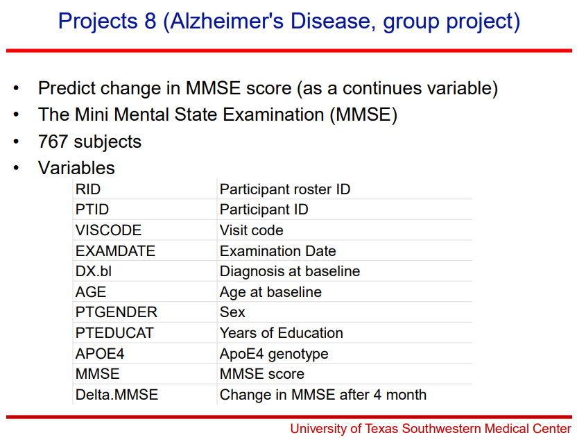
  <figcaption><b>Fig 1.</b> Project Details.</figcaption>
</figure>

<br></br>

What is the MMSE?

<figure>
  
  <figcaption><b>Link: </b> https://oxfordmedicaleducation.com/geriatrics/mini-mental-state-examination-mmse/ </figcaption>
</figure>

<br></br>

Sample MMSE:
<figure>
  
  <figcaption><b>Link: </b> https://cgatoolkit.ca/Uploads/ContentDocuments/MMSE.pdf </figcaption>
</figure>

<p align="right">(<a href="#top">back to top</a>)</p>

<!-- GETTING STARTED -->
## Getting Started

The goal of this projet is to predict the change in MMSE score `MMSE.Change` (Y) given baseline patient features. Note, this is a regression problem and although `MMSE` is a discrete count the predicted quanitity `MMSE.Change` will be treated as a continuous variable.


Preprocessing:
- Exploratory plotting
  - Pairs plot
  - Baseline vs. Target density
  - Paired density by diagnosis

Feature Selection and Dimension reduction:
- Feature selection
- PCA
- FAMD

Model training
- GLM
- RF

Dataset augmentation?
- GLM2
- RF2


### Preprocessing

```{r}
# Read in file
df <- read_xlsx('./data/AD.training.xlsx') %>% 
transform(
  PTID = factor(PTID),
  DX = factor(DX.bl),
  PTGENDER = factor(PTGENDER),
  APOE4 = factor(APOE4)
)

df %>% head()
```

First, the dataset was read into R, then the data integrity was quickly validated by
- Checking column names/datatypes
  - Including understanding the meaning of each feature/categorical entry
- Checking for missing values
- Checking basic summary statistics

Note that levels of the DX (diagnosis) column are as follows:
- CN : Cognitively normal
- EMCI : Early Mild Cognitive Impairment
- LMCI : Late Mile Cognitive Impairment
- AD : Alzheimer's Disease

<figure>
  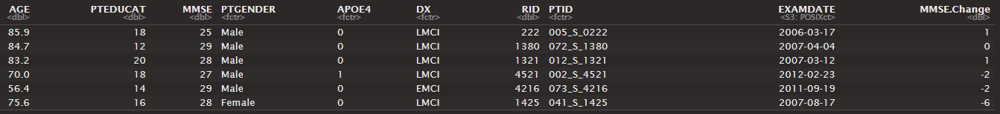
  <figcaption><b>Fig 2.</b> Head of Dataset.</figcaption>
</figure>

<p align="right">(<a href="#top">back to top</a>)</p>

After a cursory examination of the dataset, it is important to realize here that our relevant feature space is _extremely_ limited.  Of the 10 original columns in the dataset, 1 (`MMSE.Change`) is the response variable, and 3 (`RID`, `PTID`, `EXAMDATE`) have minimal-no predictive information in isolation.  This leaves only 6 columns for training on a dataset with 384 entries. In short, unless there are very dominant features with extremely high predictive value, this is very little data for a very complicated problem and this will likely result in relatively high variance in the regressive models.

### Exploratory Plotting

```{r, fig.width= 18, fig.height=18, message = FALSE, warning = FALSE}
df %>% 
  select(AGE, PTEDUCAT, MMSE, everything(), MMSE.Change, -RID, -PTID, -EXAMDATE) %>% # removing factors with too many levels or irrelevant features
  ggpairs(aes(fill = DX, alpha = 0.7), progress = FALSE)

```

There are several observations we can make from the plot below.

1) The grid pattern seen in the `MMSE` vs `PTEDUCAT` scatter plot is indicative of two discrete variables.  Indeed, both years of education and MMSE are represented as whole numbers in this dataset.  While this may not have a large impact on our predictive model, it is nevertheless important to recongize the underlying structure of our data.
2) The distribution of `MMSE` appears to be have a strong left skew. Moreover, this value is relatively weakly correleated with the outcome variable `MMSE.Change`. Later, we will examine how a couple of transforms change the correlation and distribution of `MMSE` and `MMSE.Changed`
3) Looking by eye, `MMSE.Change` seems relatively comparable between most categorical features and `MMSE` seems to be the only quantitative feature significantly correlated with the aforementioned. `DX` perhaps shows a modestly lower `MMSE.Change` in the case of AD, but the variance is quite large.  
4) Again by eye, there do not appear to be any very strong linear dependencies between features.

<figure>
  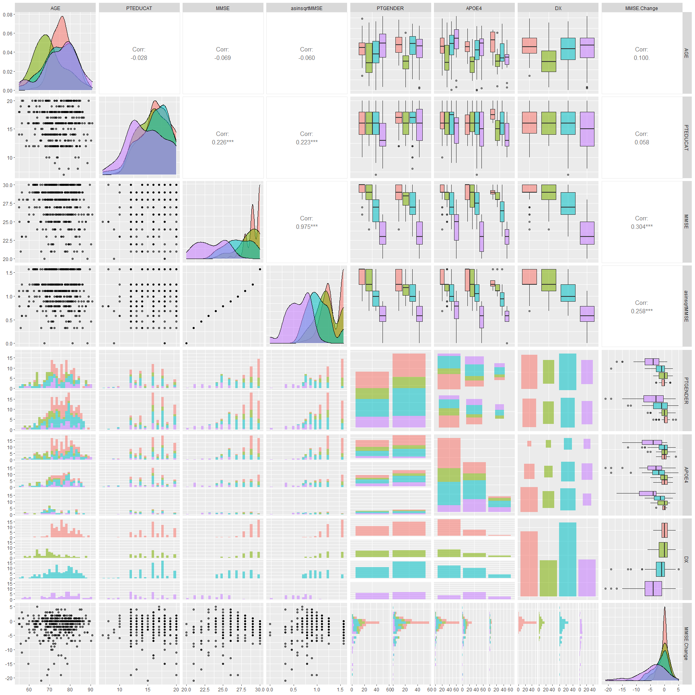
  <figcaption><b>Fig 3.</b> Exploratory Pair Plot.</figcaption>
</figure>

```{r}
df %>%
  ggplot(aes(x = `MMSE.Change`, y = DX, group = DX, fill = factor(stat(quantile)))) + 
  stat_density_ridges(
    geom = "density_ridges_gradient",
    calc_ecdf = TRUE,
    quantiles = 4,
    quantile_lines = TRUE, 
    jittered_points = TRUE,
    scale = 0.9,
    position = position_points_jitter(width = 0.05, height = 0.1),
    point_size = 1, point_alpha = 0.5, alpha = 0.7) + 
  theme_minimal() +
  scale_fill_brewer(name = 'Quartiles')
```

<figure>
  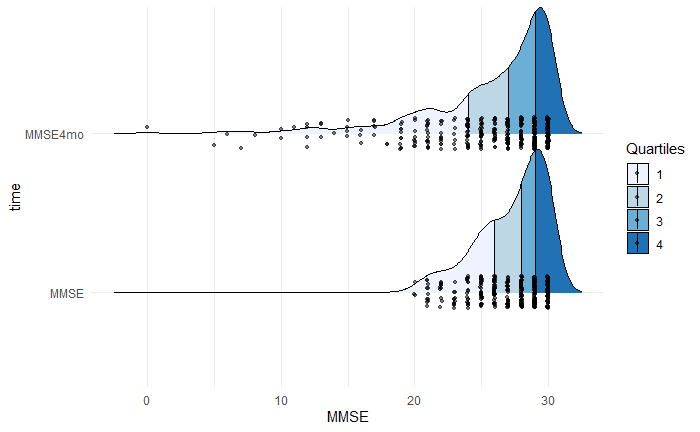
  <figcaption><b>Fig 4.</b> MMSE Ridgeline Plot.</figcaption>
</figure>

Due to the basal distributions being quite similar in both shape and range for the majority of values, it will likely be quite difficult to get a predictor with low variance.

```{r}
df %>%
  select(PTID, `MMSE.Change`, MMSE, DX) %>%
  mutate(MMSE4mo = MMSE + `MMSE.Change`) %>%
  select(-`MMSE.Change`) %>%
  pivot_longer(cols = c(MMSE4mo, MMSE),  names_to = 'time', values_to = 'MMSE') %>%
  ggplot(aes(x = MMSE, y = time, group = PTID, color = DX)) + 
    geom_jitter(width = 0.2, height = 0.075) +
    geom_line() +
    geom_violin(aes(color = NULL, fill = time, group = time), alpha = 0.15, draw_quantiles = c(0.25, 0.5, 0.75)) + 
  theme_minimal() +
  facet_wrap(~DX)
```

<figure>
  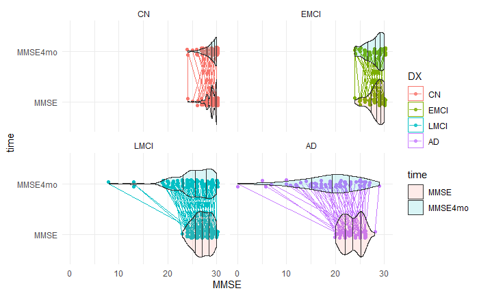
  <figcaption><b>Fig 5.</b> Change in MMSE by DX Ridgeline Plot.</figcaption>
</figure>

In some groups (CN/EMCI), the line/points clearly indicate subject variability. This variability seems to increase in LMCI and AD.  Note that because the MMSE score is capped at 30, we may have some censoring which could cause the measure of center to shift to the left.

<p align="right">(<a href="#top">back to top</a>)</p>

```{r, fig.width= 12, fig.height=12, message = FALSE, warning = FALSE}
df %>% 
  mutate(asinsqrtMMSE = asin(sqrt(minmax(MMSE))), logMMSE = log(MMSE+1), MMSE4mo = MMSE + `MMSE.Change`, logMMSE4mo = log(MMSE4mo+1), asinsqrtMMSE4mo = asin(sqrt(minmax(MMSE4mo)))) %>%
  select(MMSE, asinsqrtMMSE, logMMSE, MMSE.Change, MMSE4mo, logMMSE4mo, asinsqrtMMSE4mo, DX) %>% # removing factors with too many levels or irrelevant features
  ggpairs(aes(fill = DX, alpha = 0.7), progress = FALSE)

```

<figure>
  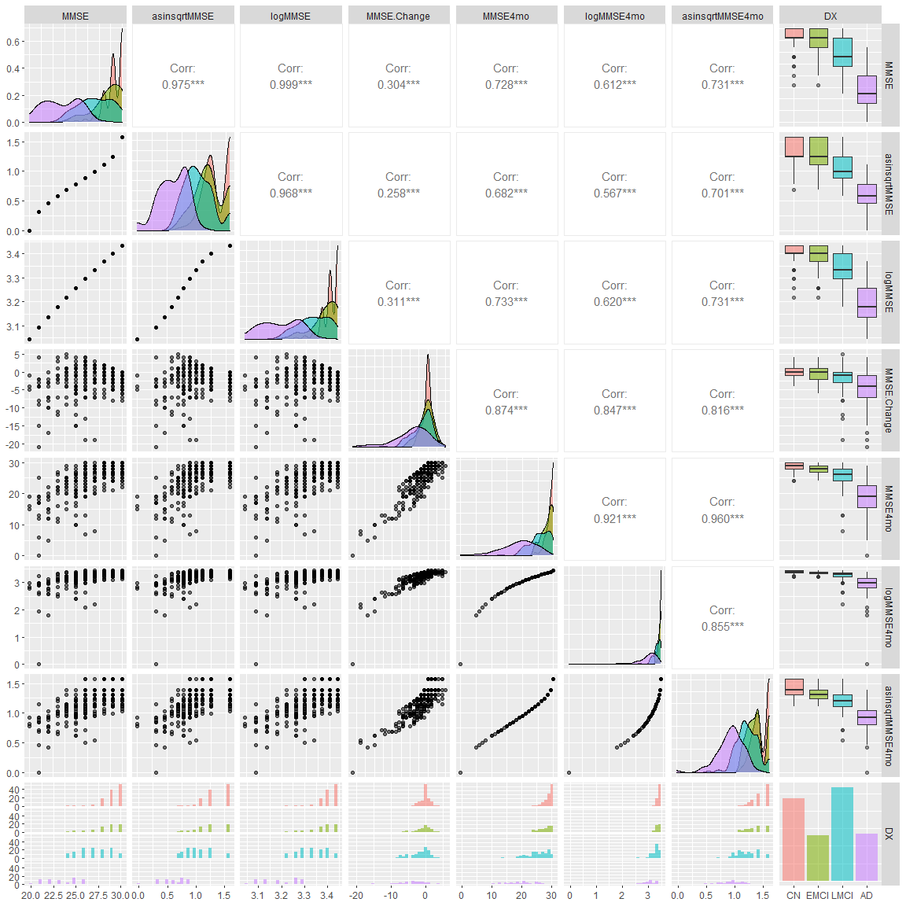
  <figcaption><b>Fig 6.</b> MMSE Transforms</figcaption>
</figure>

Note that of the transforms performed, the asin-sqrt transform of `MMSE4mo` showed the strongest correlation to the baseline `MMSE`. If necessary, we will try a model both using the transformed dependent variable and with the raw data.

### Feature Selection

`RID` and `EXAMDATE` have minimal-no predictive information and we will drop these values for all models. `PTID` will only be included in the linear mixed effects model as a random effect.

In order to see if our data can be condensed, we tried PCA and FAMD for dimensionality reduction.

* PCA

PCA is only used on the numerical columns present in the dataset (i.e. `AGE`, `PTEDUCAT`, and `MMSE`). If these features are collinear, we would expect that one of the principle component axes to be a combination of the two features an to explain a proportionally larger amount of variance. 

```
resPCA <- PCA(df_numerical) # Note, this automatically scales the data
resPCA$eig
fviz_screeplot(resPCA)
corrplot(resPCA$var$contrib, is.corr = FALSE, col = COL2('PiYG', 20))
fviz_pca_ind(resPCA, col.ind = "contrib", 
             gradient.cols = c("#00AFBB", "#E7B800", "#FC4E07"),
             repel = TRUE)
fviz_pca_var(resPCA, col.var = "contrib", 
             gradient.cols = c("#00AFBB", "#E7B800", "#FC4E07"),
             repel = TRUE)
```
<figure>
  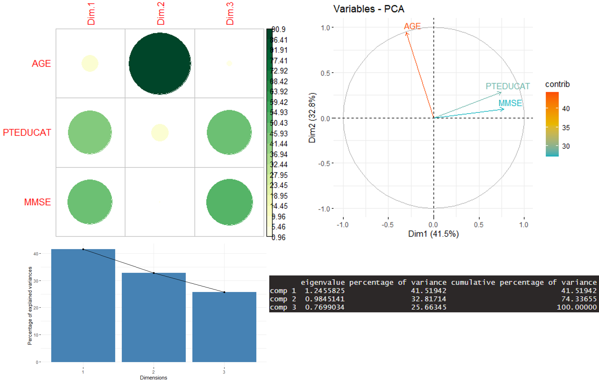
  <figcaption><b>Fig 6.</b> PCA plot of numerical variables.</figcaption>
</figure>

Here we can see that while there appears to be some overlap in information of `PTEDUCAT` and `MMSE`, the increase is not large enough, in our opinion, to justify using the PCA columns compared to the raw features.  This is in part due to the relative difficulty of explaining feature importances in PCA space.

* FAMD

FAMD (or Factor Analysis of Mixed Data) can be summarized as PCA which can tolerate categorical variables. Similar to the PCA, we are looking for collinearity/redundancy of information in our dataset.

```{r}
resFAMD <- FAMD(X)
resFAMD$eig
corrplot(resFAMD$var$contrib, is.corr = FALSE, col = COL1('YlGn', 20))
fviz_famd_var(resFAMD,"var",
             repel = TRUE)
fviz_mfa_ind(resFAMD, 
             habillage = "DX", # color by groups 
             #palette = c("#00AFBB", "#E7B800", "#FC4E07"),
             addEllipses = TRUE, ellipse.type = "confidence", 
             repel = TRUE # Avoid text overlapping
             ) 
```

<figure>
  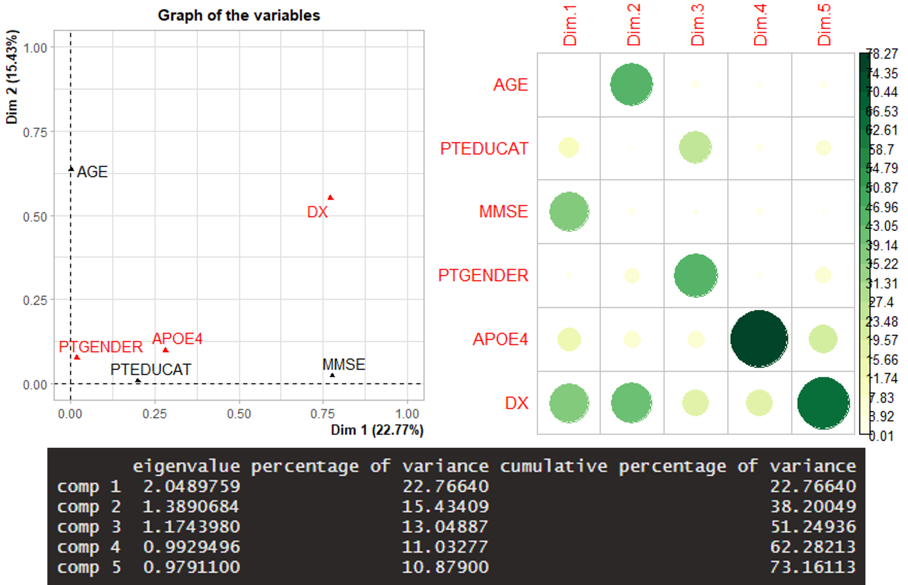
  <figcaption><b>Fig 7.</b> FAMD plots variables.</figcaption>
</figure>

Again similar to PCA, the features appear (for the most part) to represent independent information.  Once again, we do not consider the amount of varince explained to be large enough to justify the increased difficulty in model interpretability.

<p align="right">(<a href="#top">back to top</a>)</p>

## Modeling

* General Linear Model
* Random Forest
* Linear Mixed Effects

### GLM

#### Setup
```{r}
gauss <- glm(`MMSE.Change` ~ ., data = df_clean, family = gaussian())
summary(gauss)
plot(gauss)
```

```
Call:
glm(formula = MMSE.Change ~ ., family = gaussian(), data = df_clean)

Deviance Residuals: 
     Min        1Q    Median        3Q       Max  
-17.1360   -1.1402    0.2953    1.6626    8.7894  

Coefficients:
             Estimate Std. Error t value Pr(>|t|)    
(Intercept)   0.35168    3.73327   0.094 0.925000    
AGE           0.05543    0.02408   2.302 0.021878 *  
PTEDUCAT     -0.03558    0.06161  -0.578 0.563922    
MMSE         -0.14412    0.10269  -1.403 0.161316    
PTGENDERMale  0.29308    0.33798   0.867 0.386417    
APOE41       -0.34469    0.36527  -0.944 0.345946    
APOE42       -0.42068    0.55977  -0.752 0.452810    
DXEMCI       -0.01832    0.52151  -0.035 0.971994    
DXLMCI       -1.74341    0.45599  -3.823 0.000154 ***
DXAD         -5.25577    0.75794  -6.934  1.8e-11 ***
---
Signif. codes:  0 ‘***’ 0.001 ‘**’ 0.01 ‘*’ 0.05 ‘.’ 0.1 ‘ ’ 1

(Dispersion parameter for gaussian family taken to be 10.044)

    Null deviance: 4877.1  on 383  degrees of freedom
Residual deviance: 3756.5  on 374  degrees of freedom
AIC: 1987.5

Number of Fisher Scoring iterations: 2
```

<figure>
  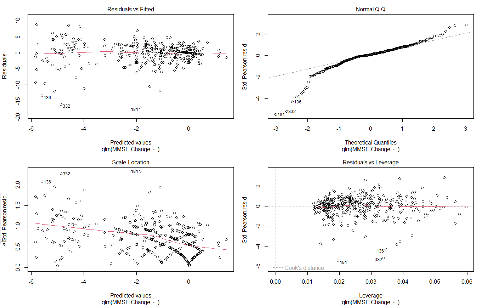
  <figcaption><b>Fig 6.</b> GLM Regression Plots.</figcaption>
</figure>

The RMSE of our model was calculated to be: `RMSE: 3.127688`.  


<p align="right">(<a href="#top">back to top</a>)</p>

### RF

#### Setup
```{r}
rf <- randomForest(`MMSE.Change` ~ ., data = df_clean, ntrees = 500, importance = TRUE, type = 'regression')
y_pred <- predict(rf)

rf
plot(rf)
importance(rf)
varImpPlot(rf)
```

```
Call:
 randomForest(formula = MMSE.Change ~ ., data = df_clean, ntrees = 500,      importance = TRUE, type = "regression") 
               Type of random forest: regression
                     Number of trees: 500
No. of variables tried at each split: 2

          Mean of squared residuals: 10.38104
                    % Var explained: 18.26
           %IncMSE IncNodePurity
AGE      10.349901     1086.5447
PTEDUCAT  1.117041      558.6845
MMSE     15.681850      843.7943
PTGENDER  3.466778      154.5082
APOE4     2.843596      285.1642
DX       26.222985      776.4001

```

<figure>
  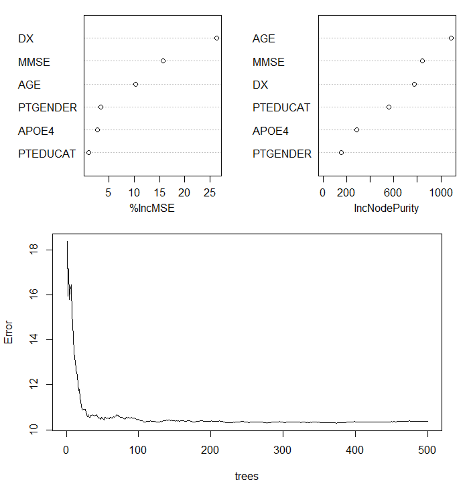
  <figcaption><b>Fig 7.</b> Random Forest Regression Plots.</figcaption>
</figure>

The RMSE of our model was calculated to be: `RMSE: 3.244548`.  

<p align="right">(<a href="#top">back to top</a>)</p>


### Linear Mixed Effects

#### Setup
```{r}
lmeMod2 <- lme(`MMSE.Change`~ AGE+MMSE+PTGENDER+PTEDUCAT+APOE4+DX, random = ~ 1|PTID, data = df_lme)
lmeMod2
summary(lmeMod2)
```

```
Linear mixed-effects model fit by REML
  Data: df_lme 
  Log-restricted-likelihood: -989.6201
  Fixed: MMSE.Change ~ AGE + MMSE + PTGENDER + PTEDUCAT + APOE4 + DX 
 (Intercept)          AGE         MMSE PTGENDERMale     PTEDUCAT       APOE41       APOE42       DXEMCI       DXLMCI         DXAD 
  0.35167737   0.05543014  -0.14411548   0.29307865  -0.03558215  -0.34469115  -0.42067946  -0.01832123  -1.74341427  -5.25577317 

Random effects:
 Formula: ~1 | PTID
        (Intercept) Residual
StdDev:    2.967406 1.112879

Fixed effects:  MMSE.Change ~ AGE + MMSE + PTGENDER + PTEDUCAT + APOE4 + DX 
 Correlation: 
             (Intr) AGE    MMSE   PTGEND PTEDUC APOE41 APOE42 DXEMCI DXLMCI
AGE          -0.582                                                        
MMSE         -0.815  0.093                                                 
PTGENDERMale  0.054 -0.100  0.008                                          
PTEDUCAT     -0.193  0.058 -0.121 -0.228                                   
APOE41       -0.124  0.107  0.028 -0.059  0.092                            
APOE42       -0.197  0.165  0.105 -0.054  0.077  0.324                     
DXEMCI       -0.319  0.303  0.148  0.006  0.029 -0.013 -0.036              
DXLMCI       -0.449  0.112  0.438 -0.021 -0.009 -0.112 -0.087  0.461       
DXAD         -0.659  0.080  0.736  0.015  0.010 -0.128 -0.064  0.350  0.608

Standardized Within-Group Residuals:
        Min          Q1         Med          Q3         Max 
-1.89867440 -0.12633857  0.03271953  0.18422209  0.97386997 

Number of Observations: 384
Number of Groups: 384 

AIC: 2003.24
BIC: 2050.331
logLik: -989.6201	

```
<figure>
  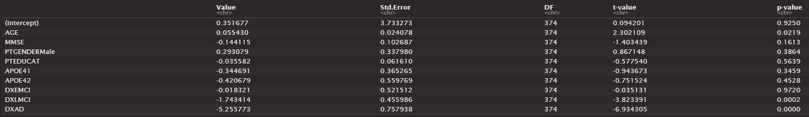
  <figcaption><b>Fig .</b> Linear Mixed Effects Summary.</figcaption>
</figure>

The RMSE of our model was calculated to be: `RMSE: 2.22836`.  

### Bayesian Mixed effects:

```{r}
bme <- brm(MMSE.Change ~ AGE+MMSE+PTGENDER+PTEDUCAT+APOE4+DX + (1 + DX|PTID), data = df_lme)
df_preds$bme <- predict(bme)
summary(bme)
```

```
  Links: mu = identity; sigma = identity 
Formula: MMSE.Change ~ AGE + MMSE + PTGENDER + PTEDUCAT + APOE4 + DX + (1 + DX | PTID) 
   Data: df_lme (Number of observations: 384) 
  Draws: 4 chains, each with iter = 2000; warmup = 1000; thin = 1;
         total post-warmup draws = 4000

Group-Level Effects: 
~PTID (Number of levels: 384) 
                      Estimate Est.Error l-95% CI u-95% CI Rhat Bulk_ESS Tail_ESS
sd(Intercept)             0.58      0.34     0.03     1.18 1.06       58      109
sd(DXEMCI)                1.33      0.36     0.66     2.11 1.02      326      324
sd(DXLMCI)                2.60      0.34     1.95     3.28 1.04      102      298
sd(DXAD)                  3.31      0.43     2.46     4.17 1.01      372      558
cor(Intercept,DXEMCI)     0.03      0.43    -0.78     0.81 1.02      270      677
cor(Intercept,DXLMCI)     0.03      0.43    -0.79     0.80 1.09       39      277
cor(DXEMCI,DXLMCI)        0.03      0.43    -0.80     0.79 1.06       66      323
cor(Intercept,DXAD)       0.09      0.44    -0.74     0.82 1.02      168      480
cor(DXEMCI,DXAD)         -0.02      0.44    -0.81     0.79 1.03      201      526
cor(DXLMCI,DXAD)          0.05      0.43    -0.78     0.80 1.01      330      517

Population-Level Effects: 
             Estimate Est.Error l-95% CI u-95% CI Rhat Bulk_ESS Tail_ESS
Intercept       11.25      2.60     6.07    16.41 1.00     2189     2653
AGE              0.01      0.02    -0.03     0.04 1.00     3614     2922
MMSE            -0.42      0.08    -0.57    -0.26 1.00     1940     2273
PTGENDERMale     0.12      0.20    -0.27     0.50 1.00     2410     2330
PTEDUCAT         0.02      0.04    -0.06     0.10 1.00     3404     2992
APOE41          -0.12      0.22    -0.55     0.32 1.00     3852     2762
APOE42          -0.58      0.39    -1.35     0.18 1.00     3322     2625
DXEMCI          -0.52      0.29    -1.11     0.04 1.00     2845     3120
DXLMCI          -2.21      0.32    -2.84    -1.59 1.00     2134     2875
DXAD            -5.78      0.64    -7.06    -4.53 1.00     2144     2360

Family Specific Parameters: 
      Estimate Est.Error l-95% CI u-95% CI Rhat Bulk_ESS Tail_ESS
sigma     1.08      0.21     0.60     1.41 1.10       48       62

Draws were sampled using sampling(NUTS). For each parameter, Bulk_ESS
and Tail_ESS are effective sample size measures, and Rhat is the potential
scale reduction factor on split chains (at convergence, Rhat = 1).
```


#### Evaluation


<p align="right">(<a href="#top">back to top</a>)</p>


## Discussion

```
df_preds %>% 
  mutate(lme_rounded = round(lme, 0)) %>%
  pivot_longer(cols = c(glm, rf, lme, lme_rounded, bme), names_to = "model", values_to = "ypred") %>%
  mutate(predresidual = MMSE.Change - ypred, model = factor(model, levels = c("rf", "glm", "lme", "lme_rounded", "bme")) ) %>%
  ggplot(aes(x = model, y = sqrt(abs(predresidual)), color = model)) + 
    geom_jitter(width = 0.3, height = 0.035, alpha = 0.7) +
    stat_summary(fun.data = mean_se, geom = "errorbar", color = "black", width= 0.2) +
    theme_minimal()


df_preds %>% 
  mutate(lme_rounded = round(lme, 0)) %>%
  pivot_longer(cols = c(glm, rf, lme, lme_rounded, bme), names_to = "model", values_to = "ypred") %>%
  mutate(model = factor(model, levels = c("rf", "glm", "lme", "lme_rounded", "bme")) ) %>%
  ggplot(aes(x = MMSE.Change, y = ypred, color = model)) + 
    geom_point(alpha = 0.7) +
    geom_abline(slope = 1, color = "red") +
    theme_minimal() +
    facet_wrap(~model)
```


```{r}
df_preds %>% 
  mutate(lme_rounded = round(lme, 0)) %>%
  pivot_longer(cols = c(glm, rf, lme, lme_rounded), names_to = "model", values_to = "ypred") %>%
  mutate(predresidual = MMSE.Change - ypred, model = factor(model, levels = c("rf", "glm", "lme", "lme_rounded")) ) %>%
  ggplot(aes(x = model, y = sqrt(abs(predresidual)), color = model)) + 
    geom_jitter(width = 0.3, height = 0.035, alpha = 0.7) +
    stat_summary(fun.data = mean_se, geom = "errorbar", color = "black", width= 0.2) +
    theme_minimal()
```
<figure>
  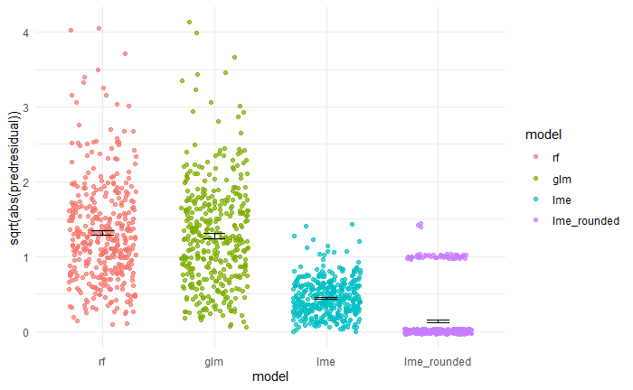
  <figcaption><b>Fig .</b> Comparisons of absolute prediction error between models.</figcaption>
</figure>

Clearly, on the training set the lme model (especially with rounded prediction) seems to have the smallest error.


```{r}
df_preds %>% 
  mutate(lme_rounded = round(lme, 0)) %>%
  pivot_longer(cols = c(glm, rf, lme, lme_rounded), names_to = "model", values_to = "ypred") %>%
  mutate(model = factor(model, levels = c("rf", "glm", "lme", "lme_rounded")) ) %>%
  ggplot(aes(x = MMSE.Change, y = ypred, color = model)) + 
    geom_point(alpha = 0.7) +
    geom_abline(slope = 1, color = "red") +
    theme_minimal() +
    facet_wrap(~model)
```
<figure>
  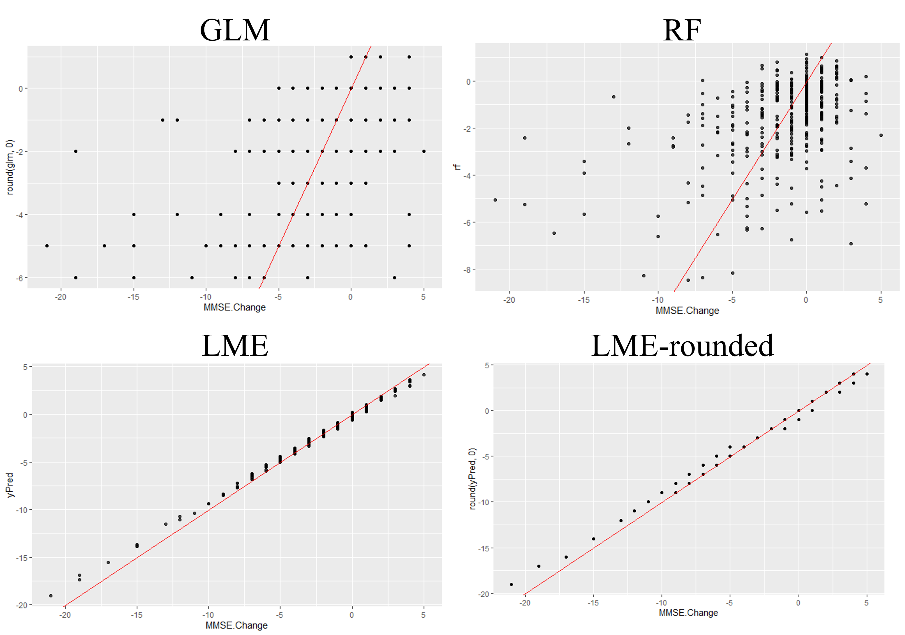
  <figcaption><b>Fig .</b> Comparisons of prediction error between models.</figcaption>
</figure>


## Conclusions


<p align="right">(<a href="#top">back to top</a>)</p>

<!-- Project Contributions -->
## Project Contributions

* Austin Marckx - Austin.Marckx@UTSouthwestern.edu
  * Preprocessing & feature selection
  * Preliminary GLM, RF, LME creation & evaluation

* Noah Chang - WooYong.Chang@UTSouthwestern.edu
  * I did this other thing
  * And that other thing

Project Link: [https://github.com/austinmarckx/2022UTSWMachineLearningFinalProj](https://github.com/austinmarckx/2022UTSWMachineLearningFinalProj)

<p align="right">(<a href="#top">back to top</a>)</p>

<!-- ACKNOWLEDGMENTS -->
## Acknowledgments

Works cited go here...

- MMSE Overview: https://oxfordmedicaleducation.com/geriatrics/mini-mental-state-examination-mmse/
- MMSE Sample Exam: https://cgatoolkit.ca/Uploads/ContentDocuments/MMSE.pdf


<p align="right">(<a href="#top">back to top</a>)</p>


<!-- MARKDOWN LINKS & IMAGES -->
<!-- https://www.markdownguide.org/basic-syntax/#reference-style-links -->
[contributors-shield]: https://img.shields.io/github/contributors/austinmarckx/2022UTSWMachineLearningFinalProj.svg?style=for-the-badge
[contributors-url]: https://github.com/austinmarckx/2022UTSWMachineLearningFinalProj/graphs/contributors
[forks-shield]: https://img.shields.io/github/forks/austinmarckx/2022UTSWMachineLearningFinalProj.svg?style=for-the-badge
[forks-url]: https://github.com/austinmarckx/2022UTSWMachineLearningFinalProj/network/members
[stars-shield]: https://img.shields.io/github/stars/austinmarckx/2022UTSWMachineLearningFinalProj.svg?style=for-the-badge
[stars-url]: https://github.com/austinmarckx/2022UTSWMachineLearningFinalProj/stargazers
[issues-shield]: https://img.shields.io/github/issues/austinmarckx/2022UTSWMachineLearningFinalProj.svg?style=for-the-badge
[issues-url]: https://github.com/austinmarckx/2022UTSWMachineLearningFinalProj/issues
[license-shield]: https://img.shields.io/github/license/austinmarckx/2022UTSWMachineLearningFinalProj.svg?style=for-the-badge
[license-url]: https://github.com/austinmarckx/2022UTSWMachineLearningFinalProj/blob/master/LICENSE.txts